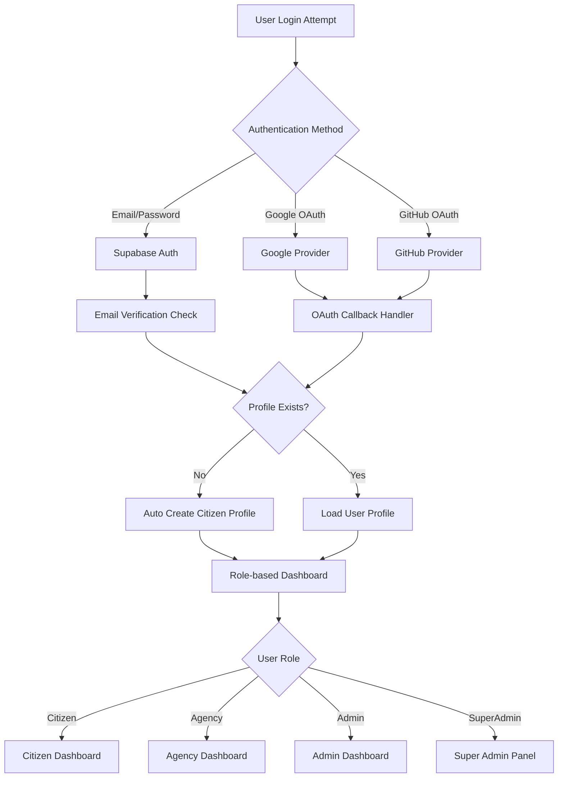

[](https://github.com/qppd/UERRA)

# UERRA - Unisan Emergency Reporting and Response App


A **real-time, cross-platform emergency reporting system** for Unisan citizens and agencies. UERRA enables fast, category-based report routing to appropriate authorities, provides emergency tips, and suggests equipment for responders.

---

## 📚 Table of Contents

- [🎯 Overview & Features](#-overview--features)
- [⚡ Quick Start Guide](#-quick-start-guide)
- [🔧 Complete Setup Guide](#-complete-setup-guide)
- [📱 User Guides](#-user-guides)
- [🛠️ Development & Technical](#️-development--technical)
- [❗ Troubleshooting](#-troubleshooting)
- [🚀 Deployment & Production](#-deployment--production)
- [📈 Features by Role](#-features-by-role)
- [🤝 Contributing & Support](#-contributing--support)

---

## 🎯 Overview & Features

### 👥 User Roles

| Role | Capabilities | Dashboard Features |
|------|-------------|-------------------|
| **🧍 Citizens** | Submit reports, track status, emergency tips | Report emergency, view my reports, emergency hotlines |
| **🏢 Agencies** | Manage assigned reports, equipment suggestions | Live map, report management, status updates |
| **🏛️ Municipal Admin** | Oversee all reports, manage categories | Analytics, agency management, report oversight |
| **⚡ Super Admin** | Full system access, user management | Complete system control, advanced analytics |

### ✨ Core Features

- 📱 **Real-time Emergency Reporting** with photo upload and GPS location
- 🗺️ **Live Map Integration** with Mapbox for location services
- 🔄 **Intelligent Auto-routing** (Fire→BFP, Medical→Hospital, Crime→PNP, etc.)
- 📊 **Analytics Dashboard** with reports statistics and trends
- 🔐 **Enhanced Authentication** with Email/Password, Google OAuth, and GitHub OAuth
- 💬 **Real-time Updates** using Supabase realtime subscriptions
- 📞 **Emergency Hotlines** quick access for all agencies
- 💡 **Context-aware Tips** emergency guidelines by category
- 📈 **Equipment Suggestions** for responders based on emergency type

### 🎨 UI/UX Enhancements

- **📱 Mobile-First Responsive Design** optimized for all screen sizes
- **👁️ Password Visibility Toggles** with eye icons for better user experience
- **⚡ Loading States & Progress Indicators** during authentication and data operations
- **✅ Real-time Form Validation** with instant feedback for email and password requirements
- **🎯 Smart OAuth Integration** with environment-aware redirect handling
- **🛡️ Enhanced Error Handling** with user-friendly error messages and recovery options
- **🔄 Auto Profile Creation** seamless onboarding for new users
- **📧 Email Verification Flow** with clear instructions and status updates
- **🖼️ Modern Authentication UI** with dual-panel layout and branded styling
- **⚠️ Offline Detection** with network status indicators

---

## ⚡ Quick Start Guide

### 🚀 Get Running in 5 Minutes

```bash
# 1. Clone and install
git clone https://github.com/qppd/UERRA.git
cd uniapp
npm install

# 2. Set up environment
cp .env.example .env
# Edit .env with your Supabase credentials

# 3. Database setup (run in Supabase SQL Editor)
# Execute: database-schema.sql

# 4. Start development
npm run dev
```

**🎉 That's it!** Open http://localhost:5173 and start reporting emergencies.

### 📋 Prerequisites Checklist

- [x] Node.js 18+ installed
- [x] Supabase account created
- [x] Project environment variables configured
- [x] Database schema executed
- [x] OAuth providers configured (optional)

### 🔐 Authentication Ready Features

Once setup is complete, users can immediately access:

- ✅ **Email/Password Registration** with validation and verification
- ✅ **Google OAuth Login** for quick social authentication
- ✅ **GitHub OAuth Login** for developer-friendly access
- ✅ **Automatic Profile Creation** with citizen role assignment
- ✅ **Role-based Dashboard Access** based on user permissions
- ✅ **Responsive Mobile Experience** optimized for emergency scenarios

---

## 🔧 Complete Setup Guide

<details>
<summary><strong>📦 Installation & Dependencies</strong></summary>

### Prerequisites
- **Node.js** (v18+ recommended) - [Download here](https://nodejs.org/)
- **npm** (comes with Node.js)
- **Supabase account** - [Sign up at supabase.com](https://supabase.com)
- **Mapbox account** (optional) - [For enhanced maps](https://www.mapbox.com/)

### Local Development Setup

```bash
# Clone the repository
git clone https://github.com/qppd/UERRA.git
cd uniapp

# Install all dependencies
npm install

# Verify installation
npm run dev
```

### Tech Stack Overview

| Component | Technology | Version | Purpose |
|-----------|------------|---------|---------|
| **Frontend** | React | 19.1.0+ | User interface |
| **Build Tool** | Vite | 7.0.4+ | Development server & bundling |
| **UI Library** | Material-UI | 7.3.1+ | Component library |
| **Backend** | Supabase | 2.53.0+ | Database, auth, realtime |
| **Maps** | Mapbox GL | 3.14.0+ | Interactive maps |
| **Charts** | Recharts | 3.1.2+ | Data visualization |
| **Code Quality** | ESLint | 9.30.1+ | Linting and code standards |

</details>

<details>
<summary><strong>🗄️ Database Configuration</strong></summary>

### Step 1: Create Supabase Project
1. Go to [Supabase Dashboard](https://supabase.com/dashboard)
2. Click **"New Project"**
3. Choose organization and set project name: `uerra-unisan`
4. Wait for database to initialize

### Step 2: Execute Database Schema
1. Navigate to **SQL Editor** in Supabase dashboard
2. Copy entire content from `database-schema.sql`
3. Paste and click **"Run"**
4. Verify tables created: `users`, `agencies`, `categories`, `reports`, `report_updates`

### Step 3: Verify Database Structure
Run this verification query:

```sql
-- Check all tables exist
SELECT table_name FROM information_schema.tables 
WHERE table_schema = 'public' 
ORDER BY table_name;

-- Verify users table structure
SELECT column_name, data_type, is_nullable 
FROM information_schema.columns 
WHERE table_schema = 'public' AND table_name = 'users'
ORDER BY ordinal_position;
```

### Database Schema Overview

| Table | Purpose | Key Columns |
|-------|---------|-------------|
| **users** | User profiles with roles | id, email, role, agency_id |
| **agencies** | Emergency response agencies | id, name, type, contact, location |
| **categories** | Emergency types | id, name, assigned_agencies, emergency_tips |
| **reports** | Citizen emergency reports | id, user_id, category_id, location, status |
| **report_updates** | Status tracking timeline | id, report_id, status, notes, created_at |

### Default Emergency Categories

1. **Fire Emergency** → Bureau of Fire Protection (BFP)
2. **Medical Emergency** → Hospital/Rural Health Unit (RHU)
3. **Crime/Security** → Philippine National Police (PNP)
4. **Natural Disaster** → Municipal Disaster Risk Reduction Management Office (MDRMMO)
5. **Road Accident** → PNP + Hospital

</details>

<details>
<summary><strong>🗃️ Storage Setup</strong></summary>

### Configure Supabase Storage for Photo Uploads

#### Step 1: Create Storage Bucket
1. Go to **Storage** in Supabase dashboard
2. Click **"Create bucket"**
3. Configure:
   - **Name**: `photos`
   - **Public bucket**: ✅ Enable
   - **File size limit**: 5MB
   - **Allowed MIME types**: `image/*`

#### Step 2: Set Row Level Security Policies

```sql
-- Policy 1: Allow authenticated users to upload photos
CREATE POLICY "Allow authenticated users to upload photos" 
ON storage.objects 
FOR INSERT TO authenticated 
WITH CHECK (bucket_id = 'photos');

-- Policy 2: Allow public viewing of photos
CREATE POLICY "Allow public viewing of photos" 
ON storage.objects 
FOR SELECT 
USING (bucket_id = 'photos');

-- Policy 3: Allow users to update their own photos
CREATE POLICY "Allow users to update own photos" 
ON storage.objects 
FOR UPDATE TO authenticated 
USING (auth.uid()::text = (storage.foldername(name))[1]);
```

#### Step 3: Test Photo Upload
1. Register/login to your app
2. Submit a test emergency report with photo
3. Check Storage → photos bucket for uploaded file

</details>

<details>
<summary><strong>🔑 Authentication & OAuth Configuration</strong></summary>

UERRA supports multiple authentication methods with enhanced security and user experience features.

### 🔐 Authentication Features

- **📧 Email/Password Authentication** with validation and security checks
- **🔗 Google OAuth Integration** for quick social login
- **🐙 GitHub OAuth Integration** for developer-friendly authentication
- **✅ Email Verification** for account security
- **👁️ Password Visibility Toggle** for better user experience
- **🔄 Loading States** with progress indicators
- **🛡️ Auto Profile Creation** with role-based access control
- **📱 Responsive Design** optimized for all devices

### Google OAuth Setup

#### Step 1: Google Cloud Console
1. Go to [Google Cloud Console](https://console.cloud.google.com/)
2. Navigate to **APIs & Services** → **Credentials**
3. Create **OAuth 2.0 Client ID** (if none exists)

#### Configure Authorized Origins:
```
http://localhost:5173
http://localhost:5174
https://yourdomain.vercel.app
```

#### Configure Authorized Redirect URIs:
```
http://localhost:5173
http://localhost:5174
https://yourdomain.vercel.app
https://YOUR_SUPABASE_URL.supabase.co/auth/v1/callback
```

#### Step 2: Supabase Google Configuration
1. Go to **Authentication** → **Providers** → **Google**
2. Enable the provider: Toggle **ON**
3. Enter **Client ID** and **Client Secret** from Google Console
4. Configure **Site URL**: `https://yourdomain.vercel.app`
5. Configure **Redirect URLs**: 
   ```
   http://localhost:5173/**,https://yourdomain.vercel.app/**
   ```

### GitHub OAuth Setup

#### Step 1: GitHub Developer Settings
1. Go to [GitHub Settings](https://github.com/settings/developers)
2. Click **"New OAuth App"**
3. Configure:
   - **Application name**: `UERRA Emergency App`
   - **Homepage URL**: `https://yourdomain.vercel.app`
   - **Authorization callback URL**: `https://YOUR_SUPABASE_URL.supabase.co/auth/v1/callback`

#### Step 2: Supabase GitHub Configuration
1. Go to **Authentication** → **Providers** → **GitHub**
2. Enable the provider: Toggle **ON**
3. Enter **Client ID** and **Client Secret** from GitHub OAuth App
4. Save configuration

### Environment Variables
Add to your `.env` file:

```bash
# Supabase Configuration (Required)
VITE_SUPABASE_URL=https://your-project.supabase.co
VITE_SUPABASE_ANON_KEY=your_anon_key_here

# Maps Configuration (Optional)
VITE_MAPBOX_TOKEN=pk.your_mapbox_token_here
```

### Authentication Flow Implementation

#### Email/Password Registration
- ✅ Email format validation
- ✅ Password strength requirements (8+ characters)
- ✅ Password confirmation matching
- ✅ Terms agreement checkbox
- ✅ Email verification process
- ✅ Automatic citizen role assignment

#### OAuth Login Process
- ✅ Secure redirect handling for production/development
- ✅ Error handling with user-friendly messages
- ✅ Loading states during authentication
- ✅ Automatic profile creation on first login
- ✅ Clean URL management after OAuth callback

#### Security Features
- ✅ Row-Level Security (RLS) policies
- ✅ JWT token management via Supabase Auth
- ✅ Secure session handling
- ✅ Protected route access based on user roles

</details>

<details>
<summary><strong>🌍 Environment Configuration</strong></summary>

### Create Environment File

```bash
# Copy environment template
cp .env.example .env
```

### Required Environment Variables

```bash
# Supabase Configuration (Required)
VITE_SUPABASE_URL=https://your-project.supabase.co
VITE_SUPABASE_ANON_KEY=your_anon_key_here

# Mapbox for Maps (Optional - app works without it)
VITE_MAPBOX_TOKEN=pk.your_mapbox_token_here

# Development Settings
VITE_APP_ENV=development
VITE_DEBUG_MODE=true
```

### Get Your Supabase Credentials:
1. Go to [Supabase Dashboard](https://supabase.com/dashboard)
2. Select your project
3. Go to **Settings** → **API**
4. Copy **Project URL** and **anon/public key**

### Get Mapbox Token (Optional):
1. Create account at [Mapbox](https://www.mapbox.com/)
2. Go to **Account** → **Access Tokens**
3. Copy default public token or create new one

</details>

---

## 📱 User Guides

<details>
<summary><strong>🧍 Citizen User Guide</strong></summary>

### 🆘 Emergency Reporting Made Simple

#### Getting Started
1. **Create Account**: Register with email/password, Google OAuth, or GitHub OAuth
2. **Email Verification**: Check your email and verify your account for security
3. **Profile Setup**: Automatic citizen role assignment and profile creation on first login
4. **Dashboard Access**: Navigate your personalized citizen dashboard with modern UI

#### 🔐 Authentication Options

##### Email/Password Registration
- **Enhanced Form Validation**: Real-time email format and password strength checking
- **Password Visibility Toggle**: Eye icons to show/hide password for better UX
- **Confirmation Matching**: Ensures password confirmation matches original
- **Terms Agreement**: Required checkbox for terms and conditions acceptance
- **Loading States**: Visual progress indicators during account creation
- **Success Feedback**: Clear confirmation messages with email verification instructions

##### Social Login Options
- **🔗 Google OAuth**: One-click sign-in with your Google account
- **🐙 GitHub OAuth**: Developer-friendly authentication for GitHub users
- **Smart Redirect Handling**: Seamless flow between development and production environments
- **Auto Profile Creation**: Automatic citizen profile setup on first social login

#### How to Report an Emergency

##### 🚨 When to Use UERRA
- **Fire emergencies** (house fires, forest fires)
- **Medical emergencies** (accidents, health crises)  
- **Crime incidents** (theft, violence, suspicious activity)
- **Natural disasters** (floods, landslides, severe weather)
- **Road accidents** (vehicle crashes, blocked roads)

##### 📝 Step-by-Step Reporting Process

1. **Access Report Form**
   - Click **"Report Emergency"** button on dashboard
   - Or use the **"+"** floating action button

2. **Select Emergency Category**
   - Choose from predefined categories
   - Each category auto-routes to appropriate agencies

3. **Provide Details**
   - **Title**: Brief description (e.g., "House Fire on Main Street")
   - **Description**: Detailed explanation of the situation
   - **Location**: GPS auto-detected (can be manually adjusted)
   - **Photo/Video**: Optional visual evidence

4. **Submit Report**
   - Review all information
   - Click **"Submit Emergency Report"**
   - Receive confirmation with report ID

5. **Track Progress**
   - Monitor status updates in real-time
   - Receive notifications when agencies respond
   - View response timeline in "My Reports"

#### Emergency Tips Integration

Each category provides **context-aware safety tips**:

| Category | Sample Tips |
|----------|-------------|
| **Fire** | Stay low to avoid smoke, Use stairs never elevators |
| **Medical** | Apply pressure to bleeding, Keep patient calm |
| **Crime** | Do not confront suspects, Move to safe location |
| **Disaster** | Move to higher ground, Stock emergency supplies |
| **Accident** | Turn on hazard lights, Check for injuries |

#### Dashboard Features for Citizens

- **📊 Report Status Dashboard**: Track all your reports
- **📍 Location Services**: GPS-enabled emergency reporting
- **📞 Emergency Hotlines**: Quick access to all agency numbers
- **💡 Safety Tips**: Category-specific emergency guidance
- **📱 Mobile Optimized**: Works seamlessly on all devices

</details>

<details>
<summary><strong>🏢 Agency User Guide</strong></summary>

### 🚨 Emergency Response Dashboard

#### Getting Started
1. **Account Assignment**: Admin assigns you to an agency
2. **Role Configuration**: Your account linked to specific agency (PNP, BFP, Hospital, etc.)
3. **Dashboard Access**: Access agency-specific emergency dashboard

#### Agency Dashboard Overview

##### 🗺️ Live Map View
- **Real-time Report Pins**: All emergency reports displayed on map
- **Color-coded Categories**: Fire (red), Medical (green), Crime (blue), etc.
- **Location Details**: Exact GPS coordinates and addresses
- **Cluster View**: Multiple reports in same area grouped together

##### 📋 Report Management Table
- **Filter by Status**: Pending, Acknowledged, In Progress, Resolved
- **Priority Levels**: Low, Medium, High, Critical
- **Assigned Reports**: Only your agency's relevant emergencies
- **Bulk Actions**: Update multiple reports simultaneously

##### 🔧 Equipment Suggestions
Intelligent recommendations based on emergency type:

| Emergency Type | Suggested Equipment |
|----------------|-------------------|
| **Fire** | Fire extinguisher, Hose, Ladder, Water tank, Protective gear |
| **Medical** | First aid kit, Stretcher, Oxygen tank, Defibrillator, Ambulance |
| **Crime** | Patrol vehicle, Communication radio, Investigation kit |
| **Disaster** | Rescue boat, Life vests, Emergency supplies, Communication equipment |
| **Accident** | Traffic cones, First aid kit, Tow truck, Ambulance |

#### Agency Workflow

1. **Receive Alert**: New reports automatically appear on dashboard
2. **Assess Priority**: Review details, location, and severity
3. **Acknowledge Report**: Change status from "Pending" to "Acknowledged"
4. **Equipment Checklist**: Review suggested equipment list
5. **Update Status**: Mark as "In Progress" when responding
6. **Add Notes**: Provide updates for citizen and other agencies
7. **Mark Resolved**: Close report when emergency is handled

#### Multi-Agency Coordination
- **Shared Reports**: Some emergencies (road accidents) involve multiple agencies
- **Update Visibility**: All assigned agencies see status changes
- **Communication Log**: Track all updates and notes
- **Handoff Capability**: Transfer primary responsibility between agencies

</details>

<details>
<summary><strong>🏛️ Admin User Guide</strong></summary>

### 🛠️ Municipal Administration Dashboard

#### Getting Started
1. **Super Admin Assignment**: Super admin grants you admin privileges
2. **Municipal Access**: Overview of all emergency operations
3. **Management Capabilities**: User, agency, and category management

#### Admin Dashboard Features

##### 📊 Analytics & Reporting
- **Real-time Statistics**: Total reports, response times, resolution rates
- **Trend Analysis**: Weekly/monthly patterns and emergency frequency
- **Category Breakdown**: Which emergency types are most common
- **Agency Performance**: Response times and resolution efficiency
- **Geographic Analysis**: Which barangays have most emergencies

##### 👥 User Management
- **Role Assignment**: Assign users to agencies or admin roles
- **Account Oversight**: View all user profiles and activity
- **Permission Control**: Grant/revoke access to different features
- **Agency Affiliation**: Link agency personnel to their departments

##### 🏢 Agency Management
- **Agency Registration**: Add new emergency response agencies
- **Contact Information**: Maintain phone numbers and addresses
- **Coverage Areas**: Define service territories
- **Capability Matrix**: What emergencies each agency handles
- **Performance Metrics**: Track agency response statistics

##### 📂 Category Management
- **Emergency Types**: Create/modify emergency categories
- **Auto-routing Rules**: Define which agencies respond to what
- **Emergency Tips**: Update safety guidelines for citizens
- **Equipment Lists**: Maintain suggested equipment per category
- **Priority Settings**: Configure automatic priority assignment

#### Advanced Features

##### 📈 Data Export & Reports
- Export emergency data to CSV/Excel
- Generate performance reports for agencies
- Create statistical summaries for municipal planning
- Backup report data for records

##### ⚙️ System Configuration
- Customize app branding and colors
- Configure notification settings
- Manage system-wide announcements
- Update emergency hotline numbers

</details>

<details>
<summary><strong>⚡ Super Admin Guide</strong></summary>

### 🔧 System Administration

#### Full System Access
- **Complete Database Control**: Direct access to all tables and data
- **User Role Management**: Assign any role to any user
- **System Configuration**: Modify core system settings
- **Advanced Analytics**: Deep insights into system performance

#### Key Responsibilities
1. **Initial System Setup**: Configure agencies, categories, and initial users
2. **Role Management**: Assign municipal admins and agency personnel
3. **System Monitoring**: Ensure optimal performance and uptime
4. **Data Backup**: Regular backup and disaster recovery procedures
5. **Security Oversight**: Monitor access patterns and security issues

#### Advanced Debugging Tools
- **User Session Debugging**: LogoutDebugPanel for authentication issues
- **Database Query Tools**: Direct SQL access for troubleshooting
- **Performance Monitoring**: Real-time system performance metrics
- **Error Logging**: Comprehensive error tracking and resolution

</details>

---

## 🛠️ Development & Technical

### 📁 Project Structure

```
uniapp/
├── src/
│   ├── components/           # React components
│   │   ├── AdminPanel.jsx     # Super admin controls
│   │   ├── AgencyDashboard.jsx # Agency emergency dashboard
│   │   ├── CitizenDashboard.jsx # Citizen reporting interface
│   │   ├── DashboardHome.jsx   # Overview dashboard
│   │   ├── EnhancedReportsPage.jsx # Advanced report management
│   │   ├── EnhancedUsersManagement.jsx # User management interface
│   │   ├── MapWidget.jsx       # Interactive map component
│   │   ├── ReportFormDialog.jsx # Emergency report form
│   │   ├── EmergencyTips.jsx   # Emergency guidelines
│   │   ├── EmergencyHotlinesPage.jsx # Quick contact interface
│   │   ├── LogoutDebugPanel.jsx # Authentication debugging
│   │   ├── OfflineHint.jsx     # Network status indicator
│   │   └── ...               # Additional UI components
│   ├── services/            # Business logic
│   │   └── CitizenReportService.js # Report submission logic
│   ├── utils/               # Utility functions
│   │   ├── authUtils.js     # Authentication helpers
│   │   └── logoutUtils.js   # Enhanced logout handling
│   ├── App.jsx              # Main application with role-based routing
│   ├── DashboardLayout.jsx  # Responsive layout wrapper
│   ├── Login.jsx            # Enhanced authentication form with OAuth
│   ├── Register.jsx         # User registration with validation
│   ├── useAuthSession.js    # Authentication state management
│   ├── useUserProfile.js    # Profile management hooks
│   ├── supabaseClient.js    # Supabase configuration
│   ├── UerraAuth.css        # Authentication-specific styling
│   ├── ResponsiveGlobal.css # Mobile-first responsive styles
│   └── DashboardLayout.css  # Dashboard-specific styling
├── public/                  # Static assets
├── database-schema.sql      # Complete database setup
├── storage-policies.sql     # Storage security policies
├── fix-*.sql               # Database migration scripts
└── package.json            # Dependencies and scripts
```

### 🔄 Enhanced Authentication Architecture



### 🔐 Enhanced Security Implementation

#### Row Level Security (RLS)
- **Users**: Can only view/edit their own profile
- **Reports**: Citizens see only their reports, agencies see assigned reports
- **Agencies**: Read-only access for all authenticated users
- **Categories**: Read-only access for all authenticated users

#### Authentication Flow Features
1. **Multiple Login Methods**: Email/password + Google OAuth + GitHub OAuth
2. **Smart Session Management**: Supabase JWT tokens with automatic refresh
3. **Enhanced Role-based Access**: Dynamic dashboard content based on user role
4. **Auto Profile Creation**: Intelligent citizen profile setup on first login
5. **Email Verification**: Security-first account verification process
6. **OAuth Callback Handling**: Robust redirect management for production/development
7. **Loading States**: User-friendly progress indicators throughout auth flow
8. **Error Handling**: Comprehensive error messages and recovery options

#### Security Enhancements
- **Environment-aware Redirects**: Dynamic OAuth redirect URLs for different environments
- **CSRF Protection**: Built-in Supabase security features
- **Token Management**: Secure JWT handling with automatic cleanup
- **Logout Security**: Enhanced logout with session cleanup and debug tools

### 📱 Responsive Design Strategy

| Screen Size | Layout | Features |
|-------------|--------|----------|
| **Mobile (< 768px)** | Single column, touch-optimized | Essential features, simplified navigation |
| **Tablet (768-1024px)** | Two-column, gesture-friendly | Full feature set, optimized spacing |
| **Desktop (> 1024px)** | Multi-column, sidebar navigation | Complete dashboard, advanced analytics |

### 🔄 Real-time Features

#### Supabase Realtime Integration
- **Report Updates**: Live status changes across all dashboards
- **New Report Alerts**: Instant notifications to relevant agencies
- **Multi-user Collaboration**: Multiple agencies can update same report
- **Connection Resilience**: Automatic reconnection on network issues

### 📊 Analytics & Monitoring

#### Built-in Analytics
- **Report Statistics**: Count by category, status, time period
- **Response Metrics**: Average response time per agency
- **Geographic Distribution**: Reports by location/barangay
- **Trend Analysis**: Weekly/monthly patterns

#### Chart Components
- **ReportsGraph**: Time-series trend visualization
- **CategoryPie**: Emergency type distribution
- **StatsCards**: Key performance indicators
- **MapWithOverlayStats**: Geographic data visualization

### 🎨 UI/UX Design System

#### Material-UI Integration
- **Consistent Theming**: Light/dark mode support
- **Responsive Components**: Mobile-first design approach
- **Accessibility**: WCAG 2.1 AA compliance
- **Color Coding**: Intuitive emergency category colors

#### Emergency Category Colors
- 🔴 **Fire**: `#ff4757` (Red)
- 🟢 **Medical**: `#2ed573` (Green)
- 🔵 **Crime**: `#3742fa` (Blue)
- 🟡 **Disaster**: `#ffa502` (Orange)
- 🟠 **Accident**: `#ff6b6b` (Light Red)

### 🧪 Development Scripts

```bash
# Development server with hot reload
npm run dev

# Production build
npm run build

# Preview production build locally
npm run preview

# Run ESLint code analysis
npm run lint

# Start development with specific port
npm run dev -- --port 3000
```

### 🔧 Configuration Files

| File | Purpose | Key Settings |
|------|---------|--------------|
| `vite.config.js` | Build configuration | React plugin, dev server settings |
| `eslint.config.js` | Code quality rules | React hooks, code standards |
| `package.json` | Dependencies | React 19, Supabase, Material-UI |

---

## ❗ Troubleshooting

<details>
<summary><strong>🔐 Authentication Issues</strong></summary>

### Common Authentication Problems

#### Problem: "Invalid credentials" error
**Solution:**
1. Verify Supabase project URL and anon key in `.env`
2. Check if user exists in Supabase Auth dashboard
3. Try password reset flow
4. Verify email confirmation (if enabled)

#### Problem: Google OAuth not working
**Solution:**
1. Check Google Cloud Console OAuth configuration
2. Verify authorized redirect URIs include your domain (without `/auth/callback`)
3. Ensure Supabase Google provider is enabled with correct Client ID/Secret
4. Check Site URL and Redirect URLs in Supabase Auth settings
5. Verify environment-specific redirect handling in OAuth flow

#### Problem: GitHub OAuth not working
**Solution:**
1. Check GitHub OAuth App configuration in Developer Settings
2. Verify Authorization callback URL: `https://YOUR_SUPABASE_URL.supabase.co/auth/v1/callback`
3. Ensure Supabase GitHub provider is enabled with correct credentials
4. Check for CORS issues in browser developer tools

#### Problem: User profile not created after OAuth login
**Solution:**
1. Check if RLS policies allow profile creation for authenticated users
2. Use LogoutDebugPanel to examine auth state and user information
3. Verify `upsertUserProfile` function is working correctly
4. Check browser console for profile creation errors
5. Manually trigger profile creation via "Create Profile" button

#### Problem: Email verification not working
**Solution:**
1. Check Supabase email settings and templates
2. Verify redirect URL matches your application domain
3. Check spam folder for verification emails
4. Ensure email provider (SMTP) is properly configured in Supabase

#### Problem: OAuth callback loop or redirect issues
**Solution:**
1. Clear browser cache and localStorage
2. Check OAuth redirect URL configuration for development vs production
3. Verify clean URL management after OAuth callback
4. Use LogoutDebugPanel to clear authentication state

### Authentication Debug Tools
- **LogoutDebugPanel**: Access authentication state inspection (development only)
- **Browser Console**: Check for OAuth callback and authentication errors
- **Supabase Dashboard**: Monitor auth logs, user sessions, and OAuth provider logs
- **Network Tab**: Inspect API calls during authentication flow

</details>

<details>
<summary><strong>🗄️ Database Issues</strong></summary>

### Common Database Problems

#### Problem: Tables not found/Permission denied
**Solution:**
1. Verify `database-schema.sql` was executed completely
2. Check RLS policies are properly configured
3. Ensure user has appropriate role assignments
4. Verify Supabase connection in network tab

#### Problem: Photo uploads failing
**Solution:**
1. Check if `photos` storage bucket exists
2. Verify storage policies allow uploads
3. Check file size limits (5MB default)
4. Ensure file type is supported (images only)

#### Problem: Reports not appearing for agencies
**Solution:**
1. Verify user has agency role and agency_id assigned
2. Check if categories are properly linked to agencies
3. Verify RLS policies allow agency users to see reports
4. Check auto-routing configuration

### Database Maintenance
```sql
-- Check database health
SELECT schemaname, tablename, attname, n_distinct, correlation 
FROM pg_stats WHERE schemaname = 'public';

-- Monitor report counts by status
SELECT status, COUNT(*) FROM reports GROUP BY status;

-- Check user role distribution
SELECT role, COUNT(*) FROM users GROUP BY role;
```

</details>

<details>
<summary><strong>🗺️ Map & Location Issues</strong></summary>

### Map Integration Problems

#### Problem: Map not loading
**Solution:**
1. Check if Mapbox token is valid and added to `.env`
2. Verify network connectivity to Mapbox services
3. Check browser console for API errors
4. Ensure token has appropriate permissions

#### Problem: GPS location not working
**Solution:**
1. Check if browser location permissions are granted
2. Verify HTTPS is used (required for geolocation)
3. Test on different devices/browsers
4. Implement fallback to manual location entry

#### Problem: Incorrect location pins
**Solution:**
1. Verify coordinate format (latitude, longitude)
2. Check PostGIS extension is installed
3. Validate location data in database
4. Test coordinate conversion functions

### Location Debugging
```javascript
// Test geolocation in browser console
navigator.geolocation.getCurrentPosition(
  position => console.log('Location:', position.coords),
  error => console.error('Location error:', error)
);
```

</details>

<details>
<summary><strong>📱 Performance & UI Issues</strong></summary>

### Performance Optimization

#### Problem: Slow dashboard loading
**Solution:**
1. Optimize image compression for photos
2. Implement pagination for large report lists
3. Use React.memo for expensive components
4. Add loading skeletons for better UX

#### Problem: Mobile responsiveness issues
**Solution:**
1. Test on actual mobile devices
2. Use Chrome DevTools device simulation
3. Check Material-UI breakpoint configurations
4. Verify touch targets meet accessibility standards

#### Problem: Real-time updates not working
**Solution:**
1. Check Supabase realtime configuration
2. Verify network connectivity and WebSocket support
3. Monitor browser console for connection errors
4. Test connection resilience with network interruptions

### Performance Monitoring
```javascript
// Monitor component render times
console.time('ComponentRender');
// ... component logic ...
console.timeEnd('ComponentRender');

// Monitor database query performance
const { data, error, count } = await supabase
  .from('reports')
  .select('*', { count: 'exact' })
  .limit(10);
console.log('Query time:', performance.now());
```

</details>

---

## 🚀 Deployment & Production

<details>
<summary><strong>🌐 Vercel Deployment</strong></summary>

### Automated Deployment Setup

#### Step 1: Prepare for Production
```bash
# Test production build locally
npm run build
npm run preview

# Verify all features work in production mode
# Check for console errors and warnings
```

#### Step 2: Vercel Configuration

Create `vercel.json` in project root:
```json
{
  "buildCommand": "npm run build",
  "outputDirectory": "dist",
  "framework": "vite",
  "env": {
    "VITE_SUPABASE_URL": "@supabase_url",
    "VITE_SUPABASE_ANON_KEY": "@supabase_anon_key",
    "VITE_MAPBOX_TOKEN": "@mapbox_token"
  }
}
```

#### Step 3: Deploy to Vercel
1. Connect GitHub repository to Vercel
2. Configure environment variables in Vercel dashboard
3. Set custom domain (optional)
4. Deploy and test production environment

#### Step 4: Post-Deployment Configuration
1. Update Supabase site URL to production domain
2. Update Google OAuth redirect URIs
3. Test all features in production
4. Monitor for any deployment-specific issues

### Environment Variables for Production
```bash
# Production Supabase Configuration
VITE_SUPABASE_URL=https://your-project.supabase.co
VITE_SUPABASE_ANON_KEY=your_production_anon_key
VITE_MAPBOX_TOKEN=pk.your_production_mapbox_token
VITE_APP_ENV=production
```

</details>

<details>
<summary><strong>📊 Production Monitoring</strong></summary>

### Key Metrics to Monitor

#### Performance Metrics
- **Page Load Time**: Target < 3 seconds
- **First Contentful Paint**: Target < 1.5 seconds
- **Database Query Time**: Target < 500ms
- **Real-time Update Latency**: Target < 1 second

#### Business Metrics
- **Daily Active Users**: Track citizen and agency engagement
- **Report Response Time**: Average time from report to agency acknowledgment
- **Resolution Rate**: Percentage of reports marked as resolved
- **System Uptime**: Target 99.9% availability

#### Error Monitoring
- **JavaScript Errors**: Monitor client-side errors
- **API Failures**: Track Supabase operation failures
- **Authentication Issues**: Monitor login/logout problems
- **Database Errors**: Track query failures and timeouts

### Production Health Checks
```bash
# API endpoint health check
curl -f https://your-app.vercel.app/api/health

# Database connectivity test
# (implement health endpoint that tests Supabase connection)

# Authentication flow test
# (automated test for login/logout cycle)
```

</details>

<details>
<summary><strong>🔒 Security Best Practices</strong></summary>

### Production Security Checklist

#### Authentication Security
- ✅ Use HTTPS for all communications
- ✅ Implement proper session timeout
- ✅ Enable email verification for new accounts
- ✅ Use strong password requirements
- ✅ Monitor for suspicious authentication patterns

#### Database Security
- ✅ Row Level Security (RLS) enabled on all tables
- ✅ Minimal API key permissions
- ✅ Regular security audits of database policies
- ✅ Backup and disaster recovery procedures
- ✅ Monitor for unusual query patterns

#### Application Security
- ✅ Input validation on all forms
- ✅ File upload restrictions (type, size)
- ✅ CORS configuration for API endpoints
- ✅ Content Security Policy (CSP) headers
- ✅ Regular dependency security updates

### Security Incident Response
1. **Identify**: Monitor alerts and logs for security events
2. **Contain**: Disable affected accounts or features
3. **Investigate**: Analyze logs and determine impact
4. **Remediate**: Fix vulnerabilities and restore service
5. **Review**: Update security policies and procedures

</details>

---

## 📈 Features by Role

### 🧍 Citizen Features
- ✅ **Emergency Report Submission** with photo/video upload
- ✅ **Real-time GPS Location** detection and manual override
- ✅ **Report Status Tracking** with live updates
- ✅ **Emergency Tips** based on selected category
- ✅ **Emergency Hotlines** quick access directory
- ✅ **Report History** view all submitted reports
- ✅ **Google OAuth** and email/password authentication
- ✅ **Mobile-responsive** design for on-the-go reporting

### 🏢 Agency Features
- ✅ **Live Map Dashboard** with emergency report pins
- ✅ **Report Management** table with filtering and sorting
- ✅ **Status Update System** for tracking emergency response
- ✅ **Equipment Suggestions** based on emergency type
- ✅ **Multi-agency Coordination** for complex emergencies
- ✅ **Priority Management** with automatic priority assignment
- ✅ **Communication Log** for updates and notes
- ✅ **Real-time Notifications** for new assignments

### 🏛️ Municipal Admin Features
- ✅ **System Analytics** dashboard with key metrics
- ✅ **User Management** with role assignment capabilities
- ✅ **Agency Management** for adding/editing response agencies
- ✅ **Category Management** for emergency types and routing
- ✅ **Performance Monitoring** for agency response times
- ✅ **Data Export** capabilities for reporting
- ✅ **System Configuration** for customization
- ✅ **Comprehensive Reporting** for municipal planning

### ⚡ Super Admin Features
- ✅ **Complete System Access** with database-level control
- ✅ **Advanced User Management** across all roles
- ✅ **System Monitoring Tools** for performance optimization
- ✅ **Debug Utilities** for troubleshooting issues
- ✅ **Security Oversight** with audit capabilities
- ✅ **System Configuration** at the deepest level
- ✅ **Backup Management** and disaster recovery
- ✅ **Integration Management** for third-party services

---

## 🤝 Contributing & Support

### 🛠️ Contributing Guidelines

#### Setting Up Development Environment
1. Fork the repository on GitHub
2. Clone your fork locally
3. Install dependencies: `npm install`
4. Set up environment variables
5. Create feature branch: `git checkout -b feature/your-feature`

#### Code Standards
- Follow ESLint configuration
- Use meaningful commit messages
- Write responsive, accessible code
- Test on multiple devices and browsers
- Document new features and APIs

#### Pull Request Process
1. Update documentation for any new features
2. Ensure all tests pass and no ESLint errors
3. Test mobile responsiveness thoroughly
4. Submit PR with detailed description
5. Wait for code review and feedback

### 🆘 Getting Help

#### Documentation Resources
- **Setup Issues**: Check the Complete Setup Guide above
- **Feature Questions**: Review User Guides for your role
- **Technical Problems**: See Troubleshooting section
- **API Documentation**: Supabase docs at [docs.supabase.com](https://docs.supabase.com)

#### Community Support
- **GitHub Issues**: Report bugs and request features
- **Discussions**: Ask questions and share ideas
- **Wiki**: Community-contributed guides and tips

#### Technical Support Contacts
- **System Administrator**: For production issues
- **Development Team**: For feature requests and bugs
- **Municipal IT**: For deployment and infrastructure

### 📄 License & Legal

This project is licensed under the **MIT License**. See the [LICENSE](LICENSE) file for details.

#### Third-party Licenses
- **React**: MIT License
- **Material-UI**: MIT License
- **Supabase**: Apache 2.0 License
- **Mapbox GL JS**: Custom License (requires API key)

---

## 📞 Emergency Contacts

### Default Agency Hotlines (Unisan)
- **🚒 Fire Emergency**: Bureau of Fire Protection - `(042) 765-4321`
- **🚑 Medical Emergency**: Unisan District Hospital - `(042) 111-2222`
- **👮 Police Emergency**: Philippine National Police - `(042) 123-4567`
- **🌊 Disaster Management**: MDRMMO - `(042) 333-4444`
- **🏥 Health Services**: Rural Health Unit - `(042) 555-6666`

### National Emergency Numbers
- **🆘 National Emergency Hotline**: `911`
- **🚒 Fire Department**: `116`
- **👮 Police**: `117`
- **🚑 Medical Emergency**: `143`

---

**Built with ❤️ for the safety and security of Unisan citizens**

*Last updated: September 16, 2025*

---

### 🔄 Recent Updates

- ✅ Fixed emoji encoding issues in documentation
- ✅ Updated dependency versions to latest stable
- ✅ Enhanced mobile responsiveness across all components
- ✅ Improved database schema with better indexing
- ✅ Added comprehensive error handling and debug tools
- ✅ Expanded user guide documentation for all roles